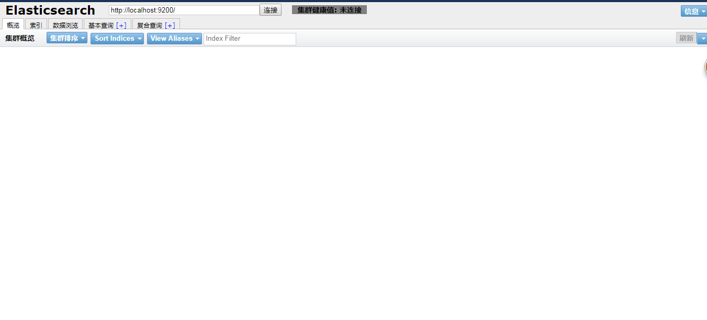

# ElasticSearch-head安装

​	elasticsearch-head是一个用来浏览、与Elastic Search簇进行交互的web前端展示插件。 elasticsearch-head是一个用来监控Elastic Search状态的客户端插件。注意，在elasticsearch6.x版本后，elasticsearch-head不在作为elasticsearch插件使用，而是作为独立的node项目部署使用。
elasticsearch-head插件主要用途：
elasticsearch主要有以下三个主要操作——

1）簇浏览，显示簇的拓扑并允许你执行索引（index)和节点层面的操作。 
2）查询接口，允许你查询簇并以原始json格式或表格的形式显示检索结果。 
3）显示簇状态，有许多快速访问的tabs用来显示簇的状态。 
4）支持Restful API接口，包含了许多选项产生感兴趣的结果，包括：

> 第一，请求方式:get,put,post,delete; json请求数据，节点node， 路径path。 
> 第二，JSON验证器。 
> 第三，定时请求的能力。 
> 第四，用javascript表达式传输结果的能力。 
> 第五，统计一段时间的结果或该段时间结果比对的能力。 
> 第六，以简单图标的形式绘制传输结果。

前提环境安装，jdk1.8,ElasticSearch6.3

```

[root@elk zmf]# wget https://github.com/mobz/elasticsearch-head/archive/elasticsearch-head-master.zip
[root@elk zmf]# unzip elasticsearch-head-master.zip
[root@elk zmf]# wget https://npm.taobao.org/mirrors/node/latest-v4.x/node-v4.4.7-linux-x64.tar.gz
[root@elk zmf]# tar -zxvf node-v9.9.0-linux-x64.tar.gz
[root@elk zmf]# mv node-v9.9.0-linux-x64 node9.9
[root@elk zmf]# nano /etc/profile
# 增加NODE_HOME环境
# export NODE_HOME=/usr/local/zmf/node9.9
export PATH=$PATH:$NODE_HOME/bin
[root@elk zmf]# source /etc/profile
[root@elk zmf]# node -v # 版本验证
# 更换阿里源
[root@elk zmf]# npm install -g cnpm --registry=https://registry.npm.taobao.org
# 安装grunt
[root@elk zmf]# cd elasticsearch-head-master
[root@elk elasticsearch-head-master]# npm install -g grunt-cli
# 安装插件 phantomjs-prebuilt安装过慢，先忽略
[root@elk elasticsearch-head-master]# npm install phantomjs-prebuilt@2.1.16 --ignore-scripts
[root@elk elasticsearch-head-master]# nano Gruntfile.js
# 找到connect 属性，新增 hostname: '*'':
[root@elk elasticsearch-head-master]# cd ../elasticsearch6.3/
[root@elk elasticsearch6.3]# nano config/elasticsearch.yml 
# 加入以下内容，注意：后面有一个空格，否则会报错
# http.cors.enabled: true
# http.cors.allow-origin: "*"
# 找到connect 属性，新增 hostname: '*'':
[root@elk zmf]# cd ../elasticsearch-head-master
[root@elk elasticsearch-head-master]# ./node_modules/grunt/bin/grunt server
```

访问head UI界面，http://192.168.199.133:9100




这里只作为学习部署使用，可以直接在Chrome浏览器应用商店安装elasticsearch-head扩展插件使用，不需要自己单独部署。

