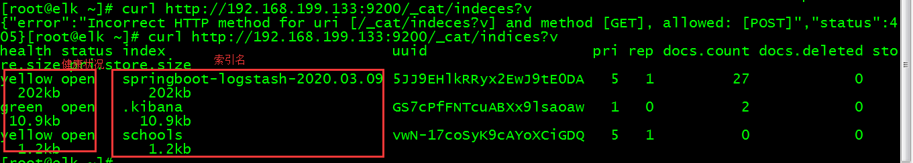

# ElasticSearch操作API

对ElasticSearch的操作是使用的Restful接口风格，直接通过浏览器或者服务器命令就可以完成增删查改。

**Elasticsearch**的主要概念如下 -

- **节点** - 它指的是Elasticsearch的单个正在运行的实例。单个物理和虚拟服务器容纳多个节点，这取决于其物理资源的能力，如RAM，存储和处理能力。
- **集群** - 它是一个或多个节点的集合。 集群为整个数据提供跨所有节点的集合索引和搜索功能。
- **索引** - 它是不同类型的文档和文档属性的集合。索引还使用分片的概念来提高性能。 例如，一组文档包含社交网络应用的数据。
- **类型/映射** - 它是共享同一索引中存在的一组公共字段的文档的集合。 例如，索引包含社交网络应用的数据，然后它可以存在用于用户简档数据的特定类型，另一类型可用于消息的数据，以及另一类型可用于评论的数据。
- **文档** - 它是以JSON格式定义的特定方式的字段集合。每个文档都属于一个类型并驻留在索引中。每个文档都与唯一标识符(称为UID)相关联。
- **碎片** - 索引被水平细分为碎片。这意味着每个碎片包含文档的所有属性，但包含的数量比索引少。水平分隔使碎片成为一个独立的节点，可以存储在任何节点中。主碎片是索引的原始水平部分，然后这些主碎片被复制到副本碎片中。
- **副本** - Elasticsearch允许用户创建其索引和分片的副本。 复制不仅有助于在故障情况下增加数据的可用性，而且还通过在这些副本中执行并行搜索操作来提高搜索的性能。

elasticsearch rest api 遵循的格式为：
```
curl -X<REST Verb> <Node>:<Port>/<Index>/<Type>/<ID>
```
因为查看操作其实是GET请求，所以curl  -X GET可以省略

检查 es 版本信息

```
curl 192.168.199.133:9200
```


查看集群是否健康

```
http://192.168.199.133:9200/_cat/health?v
```


查看节点列表

```
curl -X GET http://192.168.199.133:9200/_cat/nodes?v
```


列出所有索引及存储大小  indices/{index}

```
http://192.168.199.133:9200/_cat/indices?v
```



创建索引  添加school索引

```
curl -X PUT http://192.168.199.133:9200/school?pretty
```


添加一个类型  external

```
curl -H "Content-Type: application/json" -X PUT 'http://192.168.199.133:9200/school/external/2?pretty' -d  '{
"doc": {"name": "Jaf"}
}'
```


也可以不指定id,这个时候要改成POST请求

```
curl -H "Content-Type: application/json" -X POST 'http://192.168.199.133:9200/school/external?pretty' -d  '{
"doc": {"name": "Jaf"}
}'
```


获取指定索引、类型数据 {index}/{type}/{id} 或者{index}或者{index}/{type}/_search

```
curl -X GET http://192.168.199.133:9200/school/external/1
```


条件查询，GET请求需要带有数据体。你可能感觉很奇怪，这是ElasticSearch特有的查询

```
 curl 'localhost:9200/school/external/_search'  -d '
 {
  "query" : { "match" : { "desc" : "软件" }}
 }'
```

解析：匹配条件是`desc`字段里面包含"软件"这个词
Elastic 默认一次返回10条结果，可以通过`size`字段改变这个设置。

```
 curl 'localhost:9200/school/external/_search'  -d '
 {
  "query" : { "match" : { "desc" : "软件" }},
  "size" : 20
 }'
```

其他语法：from 偏移

逻辑语法 and 和or

```
$ curl 'localhost:9200/school/external/_search'  -d '
{
  "query" : { "match" : { "desc" : "软件 系统" }} # 软件或系统
}'
$ curl 'localhost:9200/school/external/_search'  -d '
{
  "query" : { 
  	"must"{[
  		 {"match" : { "desc" : "软件" }},
          {"match" : { "desc" : "系统" }}
     ]}   # 软件和系统
}'
```

更新一个类型

```
curl -H "Content-Type: application/json" -X POST 'http://192.168.199.133:9200/school/external/2/_update?pretty' -d  '{
	"doc": {"name": "ZHANGSAN"}
}'
```


更新也可以不适用_update关键字，这个时候POST请求要改成PUT请求

```
curl -H "Content-Type: application/json" -X PUT 'http://192.168.199.133:9200/school/external/2?pretty' -d  '{
	"doc": {"name": "ZHANGSAN"}
}'
```

删除指定索引 {index}/{type}/{id}

```
curl -X DELETE http://192.168.199.133:9200/school/external/2
```


注意：ES6 curl命令传参json数据，必须指定头-H "Content-Type: application/json"，否则会报错


