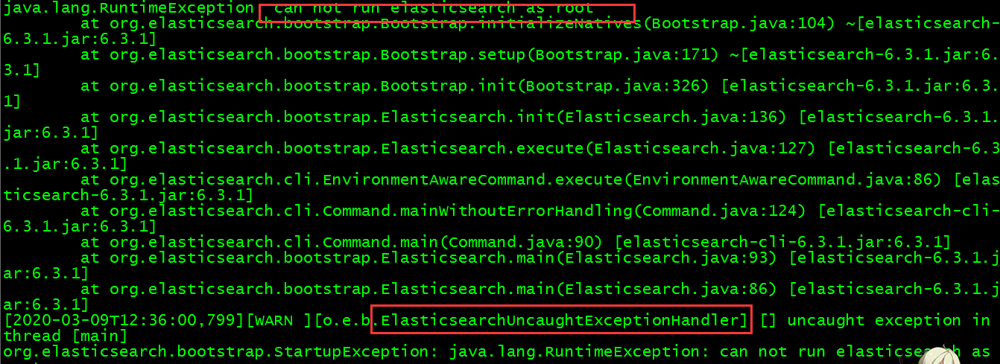
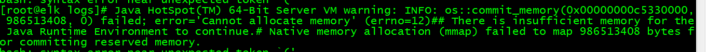
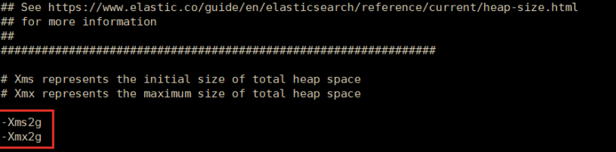
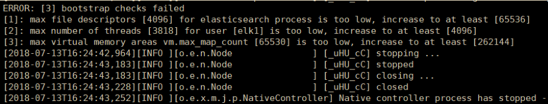
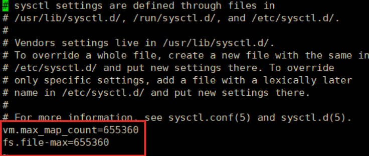

## ElasticSerach 安装

​	   Elasticsearch 是个开源分布式搜索引擎，它的特点有：分布式，零配置，自动发现，索
引自动分片，索引副本机制，restful 风格接口，多数据源，自动搜索负载等。

```
[root@elk zmf]# tar -zxvf elasticsearch-6.3.1.tar.gz
[root@elk zmf]# mv elasticsearch-6.3.1  elasticsearch6.3
[root@elk zmf]# cd elasticsearch6.3/bin
[root@elk bin]# ./elasticsearch
```
然后启动出现问题：

问题解析：Elasticsearch不能使用root用户启动，必须使用普通用户启动
解决办法：添加用户，修改目录权限

```
[root@elk zmf]# adduser elk
[root@elk zmf]# passwd elk
[root@elk zmf]# chown -R elk:elk /usr/local/zmf/elasticsearch6.3
[root@elk zmf]# su elk
[elk@elk zmf]# cd elasticsearch6.3/bin
[elk@elk bin]# ./elasticsearch
```
启动过程中出现的问题
问题解析：内存不足导致Java无法运行
解决办法：修改jvm.options配置

```
[elk@elk zmf]# cd elasticsearch6.3/conf
[elk@elk conf]# nano jvm.options
```

启动过程中出现的问题：


问题解析：系统设置的文件描述符太少了，为用户设置的可以开启的线程太少了，虚拟内存区域最大映射值太小了
解决办法：修改limits.conf和sysctl.conf配置

```
[elk@elk zmf]# su root
[root@elk zmf]# nano /etc/security/limits.conf
```
添加以下配置

修改虚拟内存区域最大映射值

```
[elk@elk zmf]# su root
[root@elk zmf]# nano /etc/sysctl.conf
```
添加以下配置


启动成功后，设置浏览器访问

```
[root@localhost bin]systemctl stop firewalld
[root@localhost bin]nano config/elasticsearch.yml
```


也可以设置为network.host: 0.0.0.0，让任何人都可以访问。线上服务不要这样设置，要设成具体的 IP。

